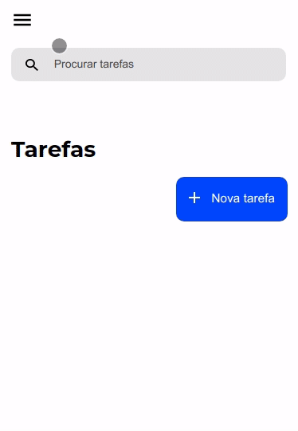

<div align="center">
</img>
</div>
<h1 align="center">Task List </h1>

👉 Access the project: [Task List](https://task-list-wls.vercel.app/)

### 🖥️ Preview
The project is responsive, it was built to support two screen sizes:
<br></br>

<div align="center">

<br></br>
<p align="center">The screen size for desktop is 1366x728px<p>
</div>
<br></br>

<div align="center">

<br></br>
<p>The screen size for mobile is 375x812px (iPhone X)</p>
</div>
<br></br>

### 🤔 What is the purpose of the project?

The project aims to consume an API, and based on that, insert, edit, remove and filter data. Thus, the user has complete freedom to manipulate the task list. 

<br></br>

### ⚙️ Functionalities
  - [x] User can add a task
  - [x] User can edit a task
  - [x] User can delete a task
  - [x] User can search for a task
  - [x] There is responsiveness on 1366x728 and 375x812 screens
  
<br></br>

### 📂 How to access the layout?
The project layout can be acessed with this link: [Figma](https://www.figma.com/file/omOeuP0G10ZgrpsZ01PdNr/Lista-de-Tarefas-(Copy)?node-id=0%3A1).

<br></br>

### :nut_and_bolt: Technologies

This project was developed with the following technologies:

- [Javascript][Javascript]
- [TypeScript][Typescript]
- [Nextjs][Nextjs]
- [SASS][SASS]
- [ReactModal][ReactModal]
- [ReactMedia][ReactMedia]
- [Axios][Axios]
  
[Javascript]: https://developer.mozilla.org/pt-BR/docs/Web/JavaScript
[Typescript]: https://www.typescriptlang.org/
[Nextjs]: https://nextjs.org/
[SASS]: https://sass-lang.com//
[ReactModal]:https://github.com/reactjs/react-modal
[ReactMedia]:https://github.com/ReactTraining/react-media
[Axios]: https://axios-http.com/ptbr/docs/intro

<br></br>
### Installation and contributing

```bash
# Clone the repository, open its folder and install dependencies with:
yarn

# Run it using
yarn start

```

### 🧑 Author

<table>
  <tr>
    <td align="center">
      <a href="https://github.com/Gabriek0">
        
        <br />
          <sub>
            <b>Gabriel Henrique</b>
          </sub>
      </a>
    </td>

  </tr>
</table>


